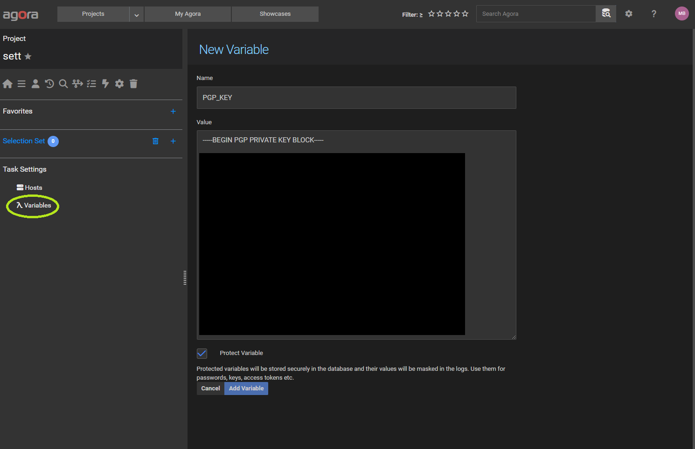
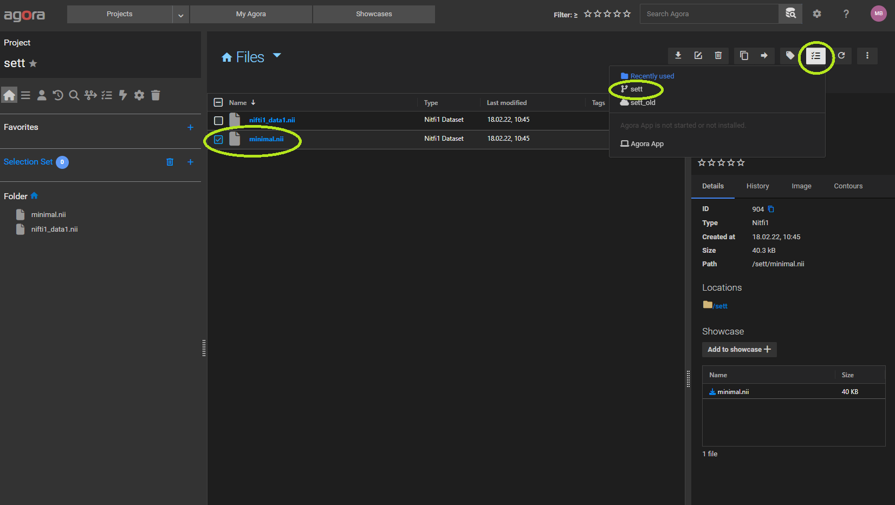

# sett

## Create an Agora Task

1. Go to the task list and then click on "Hosts" on the left sidebar
 
    

2. Add 2 SSH hosts. One for encrypting and one for transferring the data

    

    When done it should look like this:

    

3. Click on "Variables" in the left sidebar and add a variable for your PGP key, the PGP password and the SSH key of the target. Check the "Protect Variable" so that they do not show up in any log statements. 

    

    When done it should look like this:

    

4. Go back to the task list and create a new Script task:

    

5. Copy/Paste the following task into the code window:

```
# Encrypt and send data to leonard med with the sett tool
stages:
  - enc   
  - send

inputs: 
  transferid: 
    type: string 
    default: 191  
  recipient: 
    type: string  
    default: 6D37368822AA6953FA64FB6A31E8B5B93920AAB0   
  sender: 
    type: string       
    default: buehrer@biomed.ee.ethz.ch  
  nifti:
    type: dataset
    dataset_type: nifti1                    
    push_data: true
  

encrypt:     
  stage: enc
  host: encrypt_host   
  image: gyrotools/sett  
  script_type: command
  env:    
    PGP_KEY: '{{ PGP_KEY }}'
    PGP_KEY_PWD: '{{ PGP_KEY_PWD  }}'
  script: |            
    encrypt --sender {{ inputs.sender.value }} --recipient {{ inputs.recipient.value }} --dtr-id {{ inputs.transferid.value }} --purpose TEST --passphrase-cmd "cat /pgp/key.pw" --output {{ output_dir }}/agora_data.zip {{ data_dir }}
  artifacts:
    encrypted:
      path: "{{ output_dir }}/agora_data.zip" 

transfer:  
  stage: send  
  host: send_host   
  image: gyrotools/sett  
  script_type: command
  env:    
    PGP_KEY: '{{ PGP_KEY }}'
    PGP_KEY_PWD: '{{ PGP_KEY_PWD  }}'
  script: |
    transfer --protocol=sftp --protocol-args='{"host": "lm-sftransfer-01.leomed.ethz.ch","username":"dp-balgrist-dm", "destination_dir":"DIR", "pkey":"{{ SSH_KEY }}"}' {{ artifacts.encrypted.path }}

```

    The task does the following:

    - It defines 2 jobs (encrypt and transfer) which run on 2 different hosts
    - It takes a nifti file as input as well as the recipient, sender and transfer id
    - Both jobs run in a docker container (gyrotools/sett) which has the sett tool installed. The Dockerfile for this container can be found [here](./Dockerfile).
    - The variables (pgp keys) which were defined in 3.) are mapped as environment variables in the container.
    - The encrypt job encrypts the nifti file and defines it as artifact. 
    - The artifact (zip file) is then transferred to the send job (send host) and transferred with the sett tool. 
            
    **Adapt the default values and parameters if necessary.**
    
    When done it should look like this:

    

6. Save the task and go Back to the folder tree. Select a nifti file and run the task:

    

7. Observe the task output in the timeline:

    
